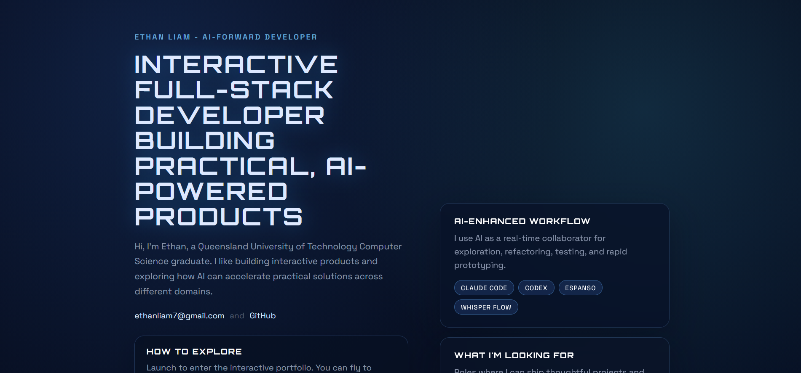
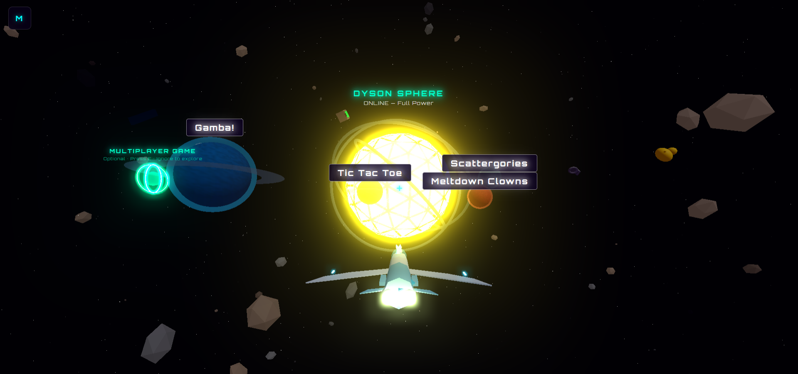
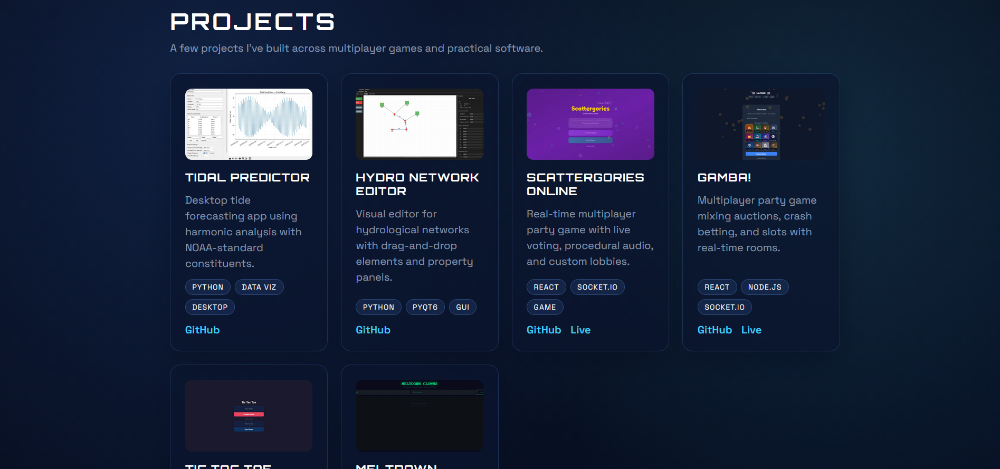

# Space Portfolio

An interactive 3D portfolio built with Three.js — fly through a solar system where each planet is a project.

---

## The Scene

Click **LAUNCH** to enter a real-time 3D space environment. Navigate with your keyboard or mouse, fly to planets to explore projects, and dock to open them.

---

## Projects

| Project | Description | Stack |
|---|---|---|
| **Scattergories Online** | Real-time multiplayer party game with voice voting, procedural audio, and custom lobbies | React, Socket.io, Node.js |
| **Gamba** | Multiplayer party game — auctions, crash betting, and slots with real-time rooms | React, Socket.io, Node.js |
| **Tic Tac Toe** | Online multiplayer with matchmaking | React, Socket.io, Node.js |
| **Meltdown Clowns** | Multiplayer survival game | React, WebSocket, Node.js |
| **Tidal Predictor** | Desktop tidal forecasting app using harmonic analysis and NOAA data | Python, Data Viz |
| **Hydro Network Editor** | Visual editor for hydrological networks with drag-and-drop panels | Python, PyQT, SVG |

---

## Tech

- **3D scene** — Three.js with lazy-loading (landing page loads in ~3KB of JS)
- **Multiplayer backends** — Socket.io / WebSocket servers deployed on Railway
- **Build** — Vite monorepo, game frontends bundled alongside the portfolio
- **Images** — WebP with PNG fallback (84% smaller than raw PNGs)

---

## Live

[elpy.up.railway.app](https://elpy.up.railway.app)

---

© Ethan Liam. All Rights Reserved.
